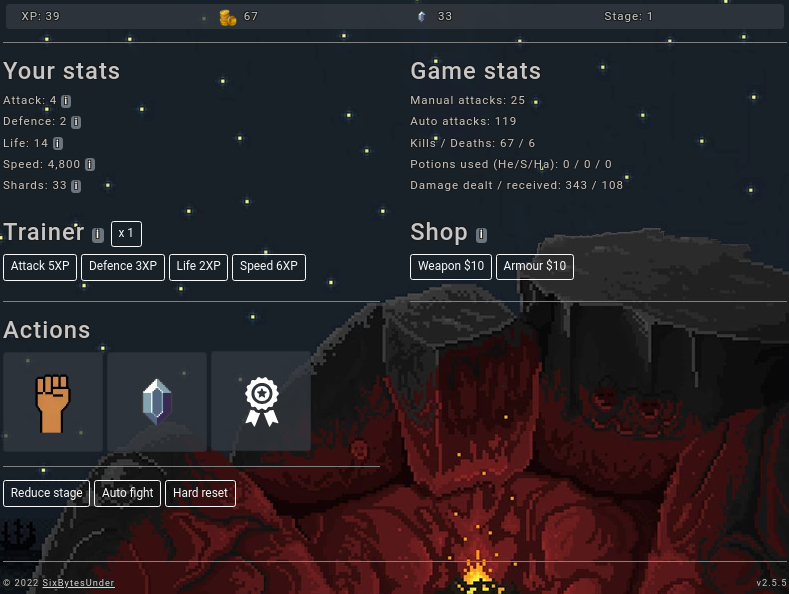
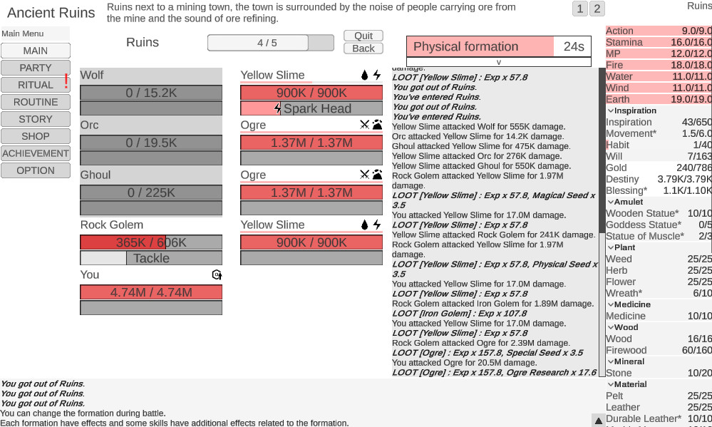

# Idle-Warrior

It's an Opensource incremental game where you could upgrade your character by spending ressources brought by combats.
Ressourcs like experience, gold, etc ...

Screenshots examples :
[Warrior Journey](https://warriorsjourney.sixbytesunder.com/)

This project will use Vue.js. (a tech that I need to learn).

## Other examples of Idle/incremental games : 

# Stats/variables :
Character :
=========
HP/life
Level -> More HP, Attack, Defense, Speed, \
Gold -> buy basic items.

Experience -> To level up. give new abilities.\
Diamonds -> Shop for special items. Like idle combat after death, ...

Zones or levels :
===============
Ennemies : Normal and Bosses (at the end of each levels)
HP, Attack, Defense, Speed.
Loot : gold, experience, research (experience for pets), 

Training :
========
Dummy to hit at max reached zone level, to test abilities and upgrade a skill.
&nbsp;
Offline progress : experience, ennmies defeated, ...

Shop :
====
Gold to spend in level access/keys, basic upgrades like training and others like a house producing facilities to gain more passive gold.

Pets :
====
Little attack and def bonus, passive mostly. Some will be available in the shop, others by defeating end level bosses.

Combat UI :
===========
A tower system that show the progress of the character, at each top of the towers there will be a final boss.
Each boss will grant passage for the next tower with a drawbridge.

Main UI :
========
Where the characters stats will be shown.
A link to the shop,
A link to the combat UI,
A link to the forge where you could craft new weapons.

Level landscapes :
================

Random generations of stages, with night/day cycles (with a nice gradient), a ground line, mountains in the background, Sun & Moon following the time of the day.\
Scrolling clouds.

Session storage :
==============
Session storage & game save export in json txt format.
Or using a SQLite DB ...
