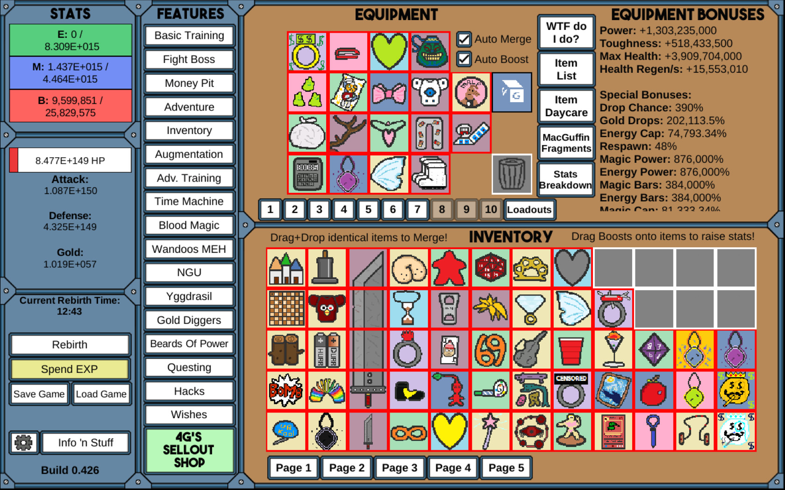

# Idle-Warrior

It's an incremental game where you could upgrade your character by spending ressources brought by combats.
Ressourcs like experience, gold, etc ...

Screenshots examples :
[Warrior Journey](https://warriorsjourney.sixbytesunder.com/)

This project will use Vue.js. (a tech that I need to learn).

## Other examples of Idle/incremental games : 

# Stats/variables :
Character :
=========
HP/life
Level -> More HP, Attack, Defense, Speed, \
Gold -> buy basic items.

Experience -> To level up. give new abilities.\
Diamonds -> Shop for special items. Like idle combat after death, ...

Zones or levels :
===============
Ennemies :
HP, Attack, Defense, Speed.
Loot : gold, experience, research (experience for pets).

Training :
========
Dummy to hit at max reached zone level, to test abilities and upgrade a skill.

Offline progress : experience, ennmies defeated, ...

Session storage & game save export in json txt format.

